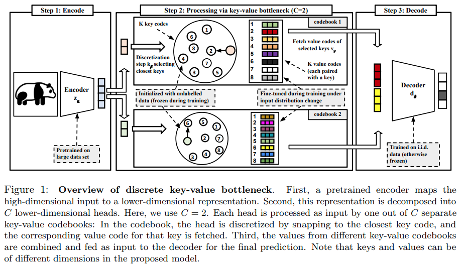

</img>

## Discrete Key / Value Bottleneck - Pytorch (wip)

Implementation of <a href="https://arxiv.org/abs/2207.11240">Discrete Key / Value Bottleneck</a>, in Pytorch. It may also include an extension into product quantization into a larger memory space.

## Install

```bash
$ pip install discrete-key-value-bottleneck-pytorch
```

## Usage

```python
import torch
from discrete_key_value_bottleneck_pytorch import DiscreteKeyValueBottleneck

key_value_bottleneck = DiscreteKeyValueBottleneck(
    dim = 512,             # input dimension
    num_memories = 256,    # number of memories
    dim_memory = 2048,     # dimension of the output memories
    decay = 0.9,           # the exponential moving average decay, lower means the keys will change faster
)

embeds = torch.randn(1, 1024, 512)  # from pretrained encoder

memories = key_value_bottleneck(embeds)

memories.shape # (1, 1024, 2048)  # (batch, seq, memory / values dimension)

# now you can use the memories for the downstream decoder
```

## Citations

```bibtex
@inproceedings{Trauble2022DiscreteKB,
    title   = {Discrete Key-Value Bottleneck},
    author  = {Frederik Trauble and Anirudh Goyal and Nasim Rahaman and Michael Curtis Mozer and Kenji Kawaguchi and Yoshua Bengio and Bernhard Scholkopf},
    year    = {2022}
}
```
